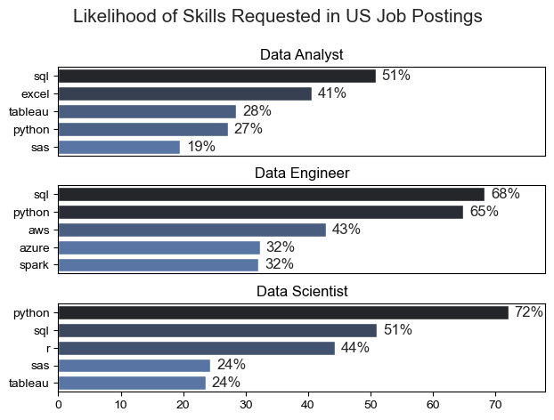

# Overview
Welcome to my analysis of the data job market, focusing on data analyst roles. This project was created out of a desire to navigate and understand the job market more effectively. It delves into the top-paying and in-demand skills to help find optimal job opportunities for data analysts.

The data sourced from Luke Barousse's Python Course which provides a foundation for my analysis, containing detailed information on job titles, salaries, locations, and essential skills. Through a series of Python scripts, I explore key questions such as the most demanded skills, salary trends, and the intersection of demand and salary in data analytics.

# The Questions
**Below are the questions I want to answer in my project:**

- What are the skills most in demand for the top 3 most popular data roles?
- How are in-demand skills trending for Data Analysts?
- How well do jobs and skills pay for Data Analysts?
- What are the optimal skills for data analysts to learn? (High Demand AND High Paying)

# The Analysis
## 1. Skill demand for the  top 3 data roles

``` df_skills_perc = pd.merge(df_job_title_count, df_skills_count, on='job_title_short', how='left')

df_skills_perc['skill_percent'] = (df_skills_perc['skill_count']/df_skills_perc['jobs_total']*100)`

df_skills_perc
```

### Results


### Insights
- SQL is in the top 3 requested skills for all 3 jobs
- Data Scientists see a drastic increse in Python but it is listed across all jobs
- Data Engineers are asked for more specific skills than Data Analysts and Scientists

## 2. How are in-demand skills trending for Data Analysts?
After filtering the top 5 skills for Data Analysts in the US we want to view the trend of demand.
To filter this I created a pivot table with a totals column and sorted by overall total of skills posted.

### Visualize Data

```python

from matplotlib.ticker import PercentFormatter

df_plot = df_DA_US_percent.iloc[:, :5]
sns.lineplot(data=df_plot, dashes=False, legend='full', palette='tab10')

plt.gca().yaxis.set_major_formatter(PercentFormatter(decimals=0))

plt.show()

```

### Results


## 3. How well do jobs and skills pay for Data Analysts?

### Method:
To find the value of certain skills I took the following steps:
1. Exploded job_skills column 
2. Grouped job_skills with salary_year_avg
3. Aggregated and sorted the data, then took only the top 10 rows

```df_da_US = df_US[df_US['job_title_short']== 'Data Analyst']

df_da_US = df_da_US.explode('job_skills')

da_us_skills = df_da_US.groupby('job_skills')['salary_year_avg'].agg(['count', 'median']).sort_values(by='count', ascending=False)

da_us_skills = da_us_skills.head(10)


da_us_top_pay = df_da_US.groupby('job_skills')['salary_year_avg'].agg(['count', 'median']).sort_values(by='median', ascending=False)
da_us_top_pay = da_us_top_pay.head(10)
```

### Visualize


```
fig, ax = plt.subplots(2, 1)  


sns.barplot(y='job_skills', x='median', data=da_us_top_pay, ax=ax[0], palette='dark:r')
ax[0].set_title('Highest Paid Skills for Data Analysts in The USA')
ax[0].set_ylabel('')
ax[0].set_xlabel('Median Salary ($USD)')
ax[0].xaxis.set_major_formatter(plt.FuncFormatter(lambda x, _: f'${int(x/1000)}K'))

sns.barplot(y='job_skills', x='median', data=da_us_skills, ax=ax[1], palette='dark:b')
ax[1].set_title('Most In-Demand Skills for Data Analysts in The USA')
ax[1].set_ylabel('')
ax[1].set_xlabel('')
ax[1].set_xlim(ax[0].get_xlim())
ax[1].xaxis.set_major_formatter(plt.FuncFormatter(lambda x, _: f'${int(x/1000)}K'))


plt.xlim(0,200000)
plt.tight_layout()
plt.show()
```

### Insights

- The highest paid in-demand skill for Data Analysts is Python at nearly $100K
- None of the highest paid skills are the most in-demand
- SQL has the highest demand of any skills for Data Analysts by a **large** margin

## What is the most optimal skill for Data Analysts?

### Method
To find the most optimal skill for Data Analysts I pulled the **top 6 skills** as requested by job postings and compared their **percentage requested** to the **median salary** of jobs requesting that skill.

```
df_skills_da = df_skills_exploded.groupby('job_skills')['salary_year_avg'].agg(['count', 'median']).sort_values('count', ascending=False)

df_skills_da.loc['Total'] = df_skills_da['count'].sum()


df_skills_da = df_skills_da.dropna()
df_skills_da = df_skills_da.rename(columns={'count': 'skill_count', 'median': 'median_salary'})
df_skills_da

da_job_count = (len(df_da_us))

df_skills_da['skill_percent'] = df_skills_da['skill_count']/da_job_count *100
df_skills_da = df_skills_da[df_skills_da['skill_count'] > 0]

df_skills_da_top_6 = df_skills_da.head(6)
df_skills_da_top_6 = df_skills_da_top_6.reset_index()
df_skills_da_top_6['skill_percent_formatted'] = df_skills_da_top_6['skill_percent'].apply(lambda x: f"{x:.2f}%")
df_skills_da_top_6
```

### Visualize

### Results
- Python is the highest paid skill that also ranks top 6 in demand.
- The most requested skill is SQL
- Excel is highly requested but not near the top in terms of pay
- PowerBI is not in the top 6
- It seems like there is a variety of tools requested. One for each step of the Data Analysis process.